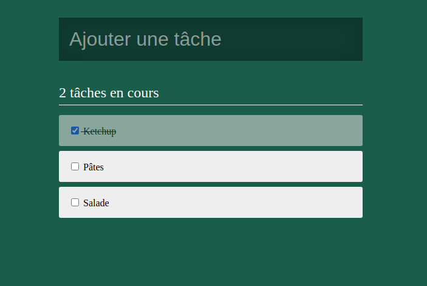

# Todolist en React

Créons une todolist avec React :smiley:

## Objectifs

Mise en place

- Un dossier `/inte` contient un exemple de structure html et de css correspondant au résultat ci-dessus
- On va reproduire la même structure mais en javascript à l'aide de React pour pouvoir ensuite intéragir facilement

Pour cela 

- S'inspirer de la structure fournie
- Découper puis créer les composants avec React en modularisant au maximum
- Gérer la structure et les styles
- Placer les props
- Dynamiser l'affichage avec des données provenant du fichier `tasks.js`

State

- Utiliser une class pour définir le state dans App
- Stocker les tâches de `tasks.js` dans le `state`
- Calculer le compteur de tâches non-effectuées à partir des données du `state` ... et s'en servir :)
- Dynamiser tout l'affichage avec les données du `state`
- Créer un composant contrôlé pour le champ
- Ajouter une nouvelle tâche

## BONUS

- Gérer le cas : cocher une tâche
- Ordonner les tâches
  - En haut, les tâches non effectuées
  - Ensuite, les tâches effectuées
